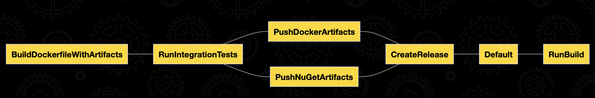

## About project
Sample of Web API and tests with Database in Docker (using [TestContainers](https://github.com/testcontainers/testcontainers-dotnet) & [Respawn](https://github.com/jbogard/Respawn) & [Nuke build](https://nuke.build) libraries)

## Projects to start
### Api
Starts the HTTP-server

### Tests
```shell
dotnet test
```

## Create Db Context migrations

```shell
#Install EF utils
dotnet tool install --global dotnet-ef

#Create schema migration
dotnet ef migrations add InitialMigration --startup-project src/Api -p src/PopulationDbContext -c PopulationDbContext
```
## Build solution using Nuke build

Install the global tool
```shell
dotnet tool install Nuke.GlobalTool --global
```

### Run build
#### Using a global tool
```shell
nuke
```

#### Using a PowerShell script
Execute from the root of the repository
```shell
pwsh build.ps1 -DockerRepositoriesUrl https://some.docker.registry -Branch some-dev-branch -BuildCounter 1 -DockerRepositoryName some-docker-repo-name -NuGetUrl https://some.nuget.registry -NuGetFeedName some-nuget-feed-name -NuGetApiKey some-nuget-api-key
```

### Execution plan
Execute the following command to see the interactive execution plan
```shell
nuke --plan
```

