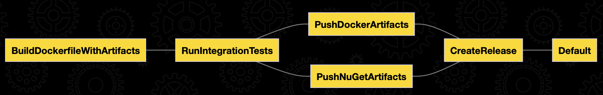

## About project
This is a sample of a Web API and tests with a Database in Docker, along with 'build as code' using Nuke Build.

Key features:
- [x] ASP.NET Core 8.0
- [x] Entity Framework Core 8.0 & PostgreSQL
- [x] [.NET Aspire](https://learn.microsoft.com/en-us/dotnet/aspire/get-started/aspire-overview) support
- [x] Build solution using [Nuke build](https://nuke.build)
- [x] Dockerfile automatic generation support using [Scriban](https://github.com/scriban/scriban)
- [x] API client generation using [NSwag](https://github.com/RicoSuter/NSwag)
- [x] Integration tests with Docker using [TestContainers](https://github.com/testcontainers/testcontainers-dotnet) and [Respawn](https://github.com/jbogard/Respawn)
- [x] Docker Compose to run all prerequisites (PostgreSQL, Grafana, Jaeger, Prometheus, etc)
- [x] Logging using [OpenTelemetry logger](https://learn.microsoft.com/en-us/dotnet/core/extensions/logging?tabs=command-line#logging-in-a-non-trivial-app) with [Seq](https://datalust.co/seq)
- [x] Metrics using [OpenTelemetry](https://opentelemetry.io) and [Prometheus](https://prometheus.io)
- [x] Tracing using [OpenTelemetry](https://opentelemetry.io) and [Jaeger](https://www.jaegertracing.io)

## Prerequisites

### Main
- [.NET 8.0 SDK](https://dotnet.microsoft.com/download/dotnet/8.0)
- [.NET Aspire workload](https://learn.microsoft.com/en-us/dotnet/aspire/get-started/aspire-overview)
  - Execute `dotnet workload install aspire` to install it
- [Docker](https://www.docker.com/get-started)

### Running API
In order to run the API, you need to have a PostgreSQL database running. 
You can use .NET Aspire [AppHost](src/Aspire/AppHost) or the provided [Docker Compose file](docker-compose.yml) to run it.

List of services:
- PostgreSQL (db): `localhost:5432`
- Grafana (dashboards): http://localhost:3000
- Jaeger (tracing): http://localhost:16686
- Prometheus (metrics): http://localhost:9090
- Seq (logs): http://localhost:5200

## Projects to start
### API
Starts the HTTP-server

### Tests
Execute all tests
```shell
dotnet test
```

Execute only integration tests
```shell
dotnet test --filter Category=IntegrationTests
```

## Create Db Context migrations

```shell
#Install EF utils
dotnet tool install --global dotnet-ef

#Create schema migration
dotnet ef migrations add <Name of your migration> --startup-project src/Api -p src/Store -c PopulationDbContext
```
## Build solution using Nuke build

Install the global tool
```shell
dotnet tool install Nuke.GlobalTool --global
```

### Run build
#### Using a global tool
```shell
nuke
```

#### Using a PowerShell script
Execute from the root of the repository
```shell
pwsh build.ps1 -DockerRepositoriesUrl https://some.docker.registry -Branch some-dev-branch -BuildCounter 1 -DockerRepositoryName some-docker-repo-name -NuGetUrl https://some.nuget.registry -NuGetFeedName some-nuget-feed-name -NuGetApiKey some-nuget-api-key
```

### Execution plan
Execute the following command to see the interactive execution plan
```shell
nuke --plan
```


## API Client
API client is generated using [NSwag](https://github.com/RicoSuter/NSwag) tool.

It generates automatically when ClientGenerator project is built.

See more details in NSwag documentation and [nswag.json](src/ClientGenerator/nswag.json) file.

## Metrics

To see current app metrics, go to http://localhost:5005/metrics

## Grafana

Grafana runs automatically using Docker Compose and is available at http://localhost:3000.
It has following predefined data sources:
- Prometheus
- Jaeger